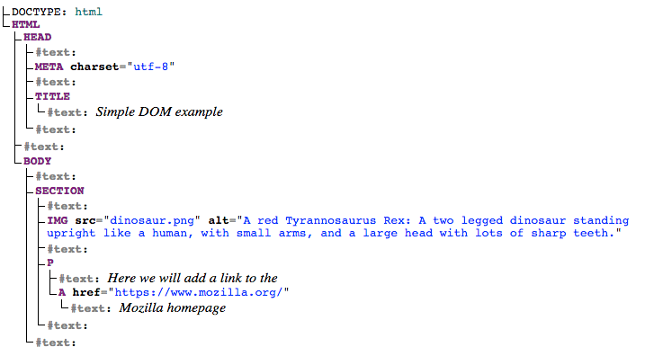

# DOM Scripting - Condensed Notes

## Important Parts of a Web Browser

![Browser parts diagram showing Navigator > Window > Document hierarchy]

- **Navigator** (`Navigator` object): Browser state and identity
  - Retrieve user's preferred language, webcam access, etc.

- **Window** (`Window` object): Browser tab containing the web page
  - Access window size: `Window.innerWidth`, `Window.innerHeight`
  - Manipulate document, store client-side data, attach event handlers

- **Document** (`Document` object): Actual page loaded in window (the DOM)
  - Manipulate HTML/CSS, get element references, change content, create/delete elements

## Document Object Model (DOM)

The DOM is a tree structure representation that enables HTML to be accessed by programming languages.

### Example HTML:
```html
<!doctype html>
<html lang="en-US">
  <head>
    <meta charset="utf-8" />
    <title>Simple DOM example</title>
  </head>
  <body>
    <section>
      
      <p>
        Here we will add a link to the
        <a href="https://www.mozilla.org/">Mozilla homepage</a>
      </p>
    </section>
  </body>
</html>
```



### Node Terminology:
- **Root node**: Top node (usually `HTML`)
- **Child node**: Node *directly* inside another node
- **Descendant node**: Node anywhere inside another node
- **Parent node**: Node containing another node
- **Sibling nodes**: Nodes on same level under same parent

## Basic DOM Manipulation

### Selecting Elements:
```js
// Modern approach (recommended), select elements using CSS selectors
// will match the FIRST object that satisfies this selector
const link = document.querySelector("a");
//apply to all elements that matches the selector
const allLinks = document.querySelectorAll("a"); // Returns NodeList

// Older methods
const elementRef = document.getElementById('myId');
const elementRefArray = document.getElementsByTagName('p');
```

### Modifying Elements:
```js
// Change text content
link.textContent = "Mozilla Developer Network";

// Change attributes
link.href = "https://developer.mozilla.org";
```

## Creating and Placing New Nodes

```js
// Get reference to section
const sect = document.querySelector("section");

// Create new paragraph
const para = document.createElement("p");
para.textContent = "We hope you enjoyed the ride.";

// Append to section
sect.appendChild(para);

// Create text node
const text = document.createTextNode(" — the premier source for web development knowledge.");

// Append to existing paragraph
// THIS IS HOW YOU ADD NEW NODES
const linkPara = document.querySelector("p");
linkPara.appendChild(text);
```

## Moving and Removing Elements

### Moving:
```js
// Move paragraph to bottom of section
sect.appendChild(linkPara); // Moves, DOES NOT COPY
```

### Removing:
```js
// Method 1: Remove child from parent
sect.removeChild(linkPara);

// Method 2: Remove element directly (modern)
linkPara.remove();

// Method 3: Older browser support
linkPara.parentNode.removeChild(linkPara);
```

### Copying:
```js
// Clone a node
const linkParaCopy = linkPara.cloneNode(true); // true = deep clone
```

## Manipulating Styles

### Method 1: Inline Styles
```js
para.style.color = "white";
para.style.backgroundColor = "black";
para.style.padding = "10px";
para.style.width = "250px";
para.style.textAlign = "center";
```

**Note**: JavaScript uses camelCase (`backgroundColor`) vs CSS kebab-case (`background-color`)

### Method 2: CSS Classes
```html
<!-- Add CSS in head -->
<style>
  .highlight {
    color: white;
    background-color: black;
    padding: 10px;
    width: 250px;
    text-align: center;
  }
</style>
```

```js
// Apply class using setAttribute
para.setAttribute("class", "highlight");
```

## Best Practices
- Use `querySelector()` for modern element selection
- Prefer CSS classes over inline styles for complex styling
- Always empty form inputs after processing
- Use event listeners for interactive functionality